# Home Credit Default Risk - Data Analysis & Feature Engineering

This directory contains the comprehensive data analysis and feature engineering report for the Home Credit Default Risk project. It combines Exploratory Data Analysis (EDA) findings with the results of advanced feature engineering strategies.

## 📂 Folder Structure

- **`eda_analysis.py`**: Main EDA script. Loads data, performs statistical analysis, and generates visualization plots in `plots/`.
- **`eda_analysis_partner.py`**: Supplementary analysis script (text-based summaries, missing value analysis).
- **`generate_report.py`**: Automates the creation of a structured DOCX report.
- **`stats_helper.py`**: Helper functions for statistics and correlations.
- **`plots/`**: Directory containing generated figures.

---

## 📊 Part 1: Exploratory Data Analysis (EDA)

### 1. Target Variable & Data Quality

**Target Distribution**
The dataset is highly imbalanced, with a default rate of approximately 8%.
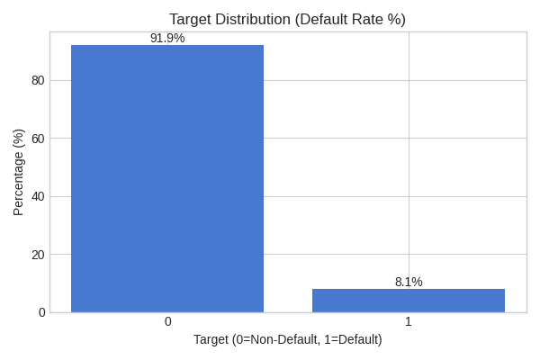

**Missing Values**
Overview of the top 30 features with the highest percentage of missing values.
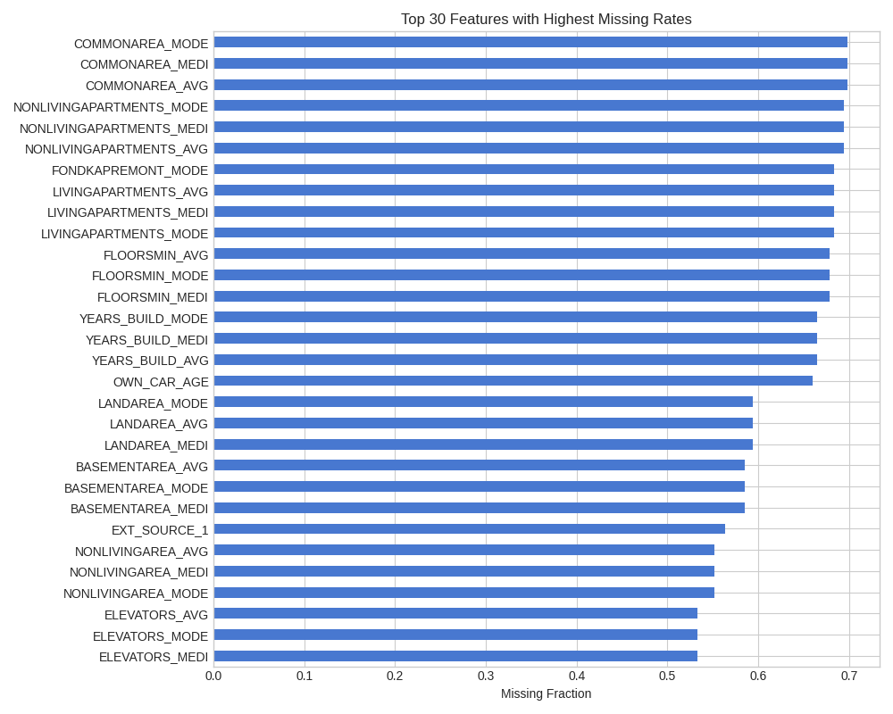

### 2. Demographic Features

**Age vs Default Risk**
Younger applicants show a higher probability of default.
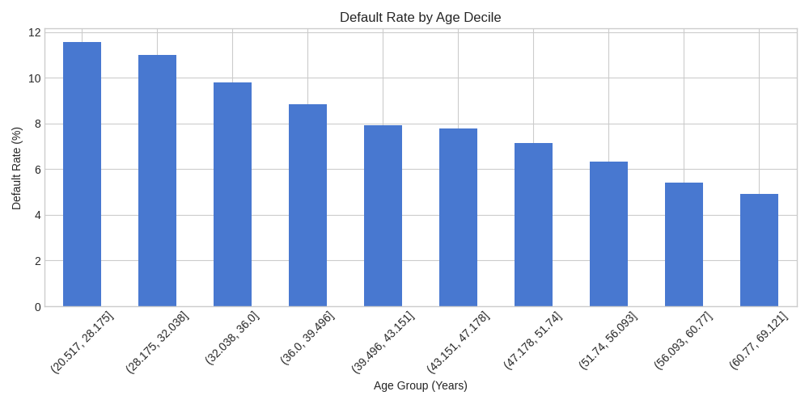

**Employment Length**
Longer employment duration is generally associated with lower default risk.
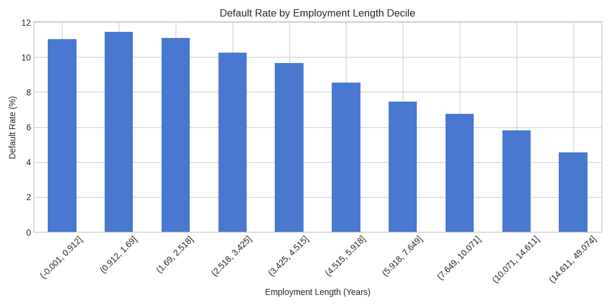

**Categorical Features Analysis**
Default rates by Gender and Contract Type.
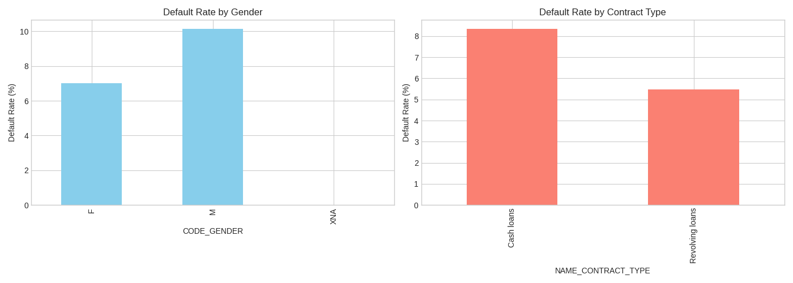

### 3. Financial Indicators

**Credit-to-Income Ratio**
Applicants with higher credit-to-income ratios tend to have higher default rates.
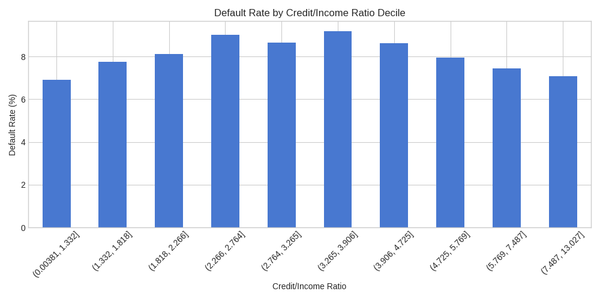

**Credit Card Utilization**
Higher utilization of credit card limits correlates with increased risk.
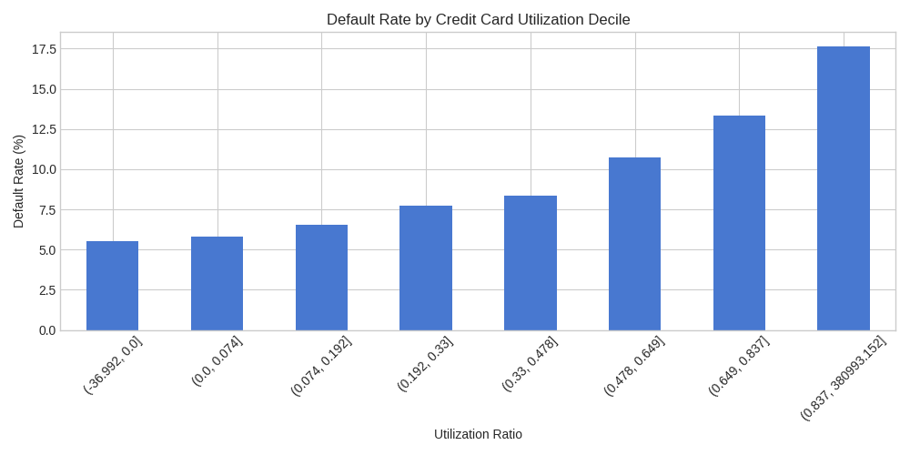

### 4. External Sources & Correlations

**External Source 2**
Strong negative correlation: higher external scores indicate lower default probability.
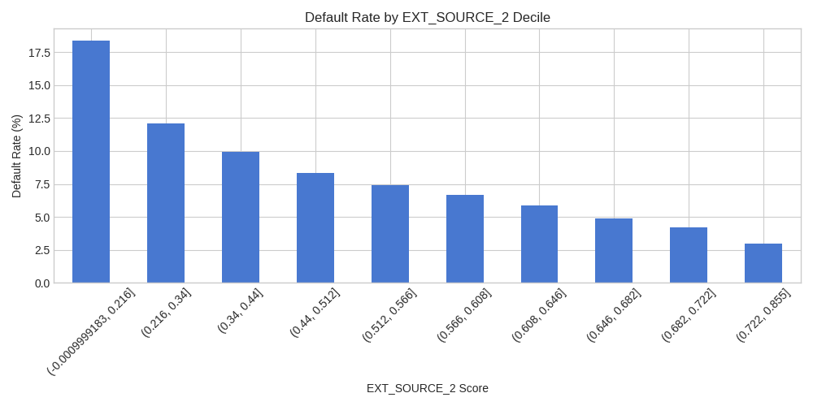

**Correlation Heatmap**
Relationships between the target variable and key features.
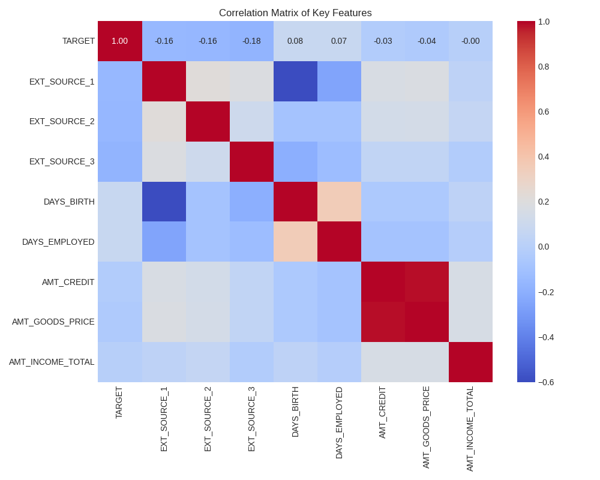

### 5. Historical Behavior

**Previous Application Refusals**
A history of refused applications is a strong risk indicator.
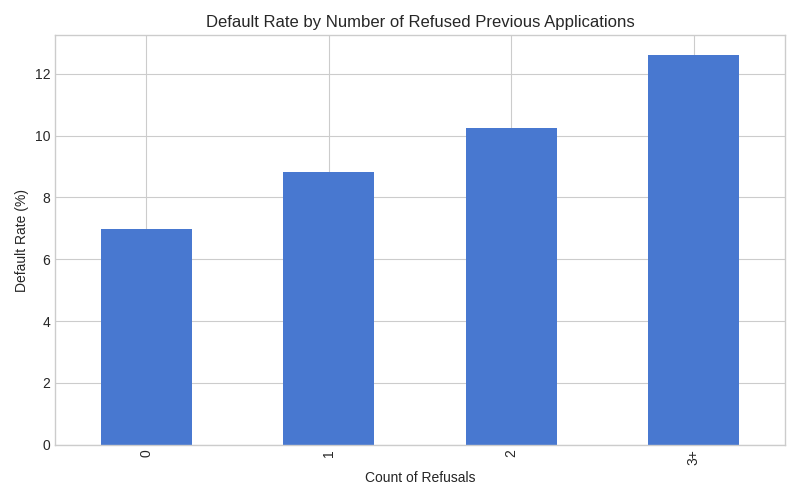

**Active Bureau Credits**
Number of active credits currently held by the applicant.
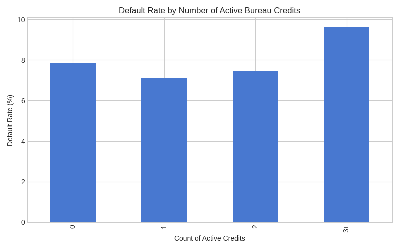

**Installments Days Past Due (DPD)**
History of late payments (Days Past Due) significantly impacts default risk.
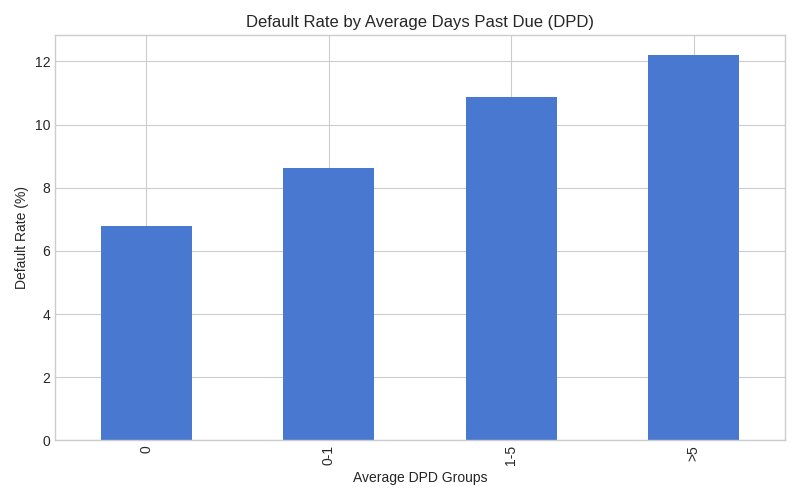

### 6. Additional Findings

**Target Imbalance**
The dataset shows a long-tail distribution where the default class is less than 1:10.


**Income Impact**
Low-income applicants show relatively higher risk.
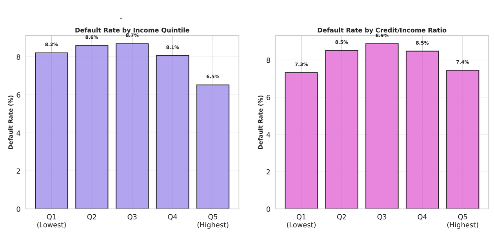

**Employment Risk**
Low-skilled laborers and those with less working time tend to have higher risk.
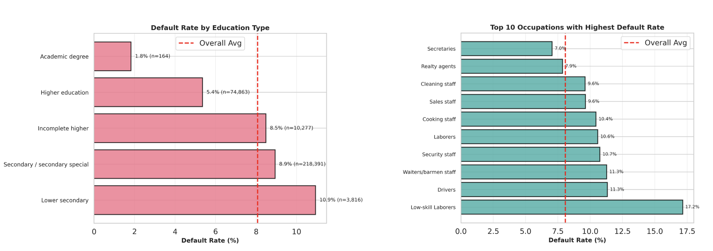
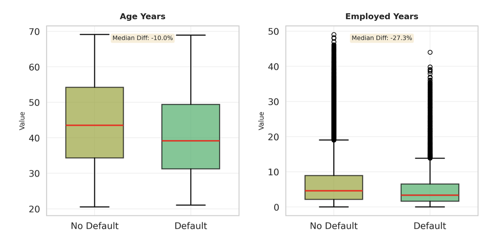

**Living Situation**
Applicants renting or living with parents, and those with larger families, show higher risk.
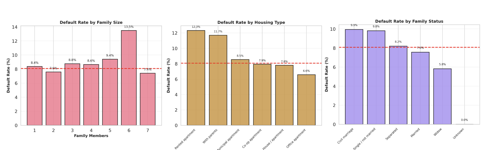

**External Sources**
Clear correlation: smaller EXT_SOURCE values indicate higher risk.


---

## 🏗 Part 2: Feature Engineering Report

This section details the feature engineering improvements that boosted model performance.

### 📈 Performance Summary

**Baseline vs Advanced Model**

| Model | Val AUC | Features | Training Method |
|-------|---------|----------|-----------------|
| Baseline | 0.788 | 288 | Single Validation |
| **Advanced** | **0.791** | **425** | **5-Fold CV** |

**Performance Gain: +0.3% (0.003 AUC points)**

**Cross-Validation Results:**
```
Fold 1 AUC: 0.789441
Fold 2 AUC: 0.797052  ⭐ Best
Fold 3 AUC: 0.787272
Fold 4 AUC: 0.795510
Fold 5 AUC: 0.787784

Overall Out-of-Fold AUC: 0.791332
CV Mean AUC: 0.791412 (+/- 0.004069)
```

### 🛠 New Feature Categories

#### 1. Basic Derived Features (10)
- **Time Conversion**: `AGE_YEARS`, `EMPLOYED_YEARS`, `REGISTRATION_YEARS`, `ID_PUBLISH_YEARS`.
- **Age Groups**: `AGE_GROUP` (bins), `YOUNG_AGE` (<30), `RETIREMENT_AGE` (>60).
- **Employment**: `RECENTLY_EMPLOYED` (<2y), `LONG_EMPLOYED` (>10y), `UNEMPLOYED`.

#### 2. Income & Credit Ratios (8)
- **Core Ratios**: `CREDIT_INCOME_RATIO` ⭐, `ANNUITY_INCOME_RATIO`, `GOODS_PRICE_INCOME_RATIO`, `CREDIT_TERM` ⭐⭐⭐.
- **Differences**: `CREDIT_GOODS_DIFF` ⭐⭐, `CREDIT_GOODS_DIFF_RATIO`.

#### 3. Family & Demographics (8)
- `INCOME_PER_PERSON`, `INCOME_PER_CHILD`, `CHILDREN_RATIO`.
- `LARGE_FAMILY` (>4 members), `HIGH_CREDIT`, `LOW_INCOME`.

#### 4. External Scores (14) ⭐⭐⭐ Most Important
- **Aggregates**: `EXT_SOURCE_MEAN` ⭐⭐⭐⭐⭐, `EXT_SOURCE_STD`, `EXT_SOURCE_MIN`, `EXT_SOURCE_MAX`.
- **Interactions**: `EXT_SOURCE_1_2_MUL`, `EXT_SOURCE_2_3_MUL` ⭐⭐⭐.
- **Contextual**: `EXT_SOURCE_MEAN_INCOME_RATIO`.

#### 5. Behavioral History (Derived from Auxiliary Tables)
- **Bureau**: `BUREAU_DEBT_CREDIT_RATIO` ⭐⭐⭐, `BUREAU_ACTIVE_RATIO`.
- **Previous Apps**: `PREV_APPROVED_RATIO` ⭐⭐⭐, `PREV_REFUSED_RATIO` ⭐⭐⭐.
- **Installments**: `INSTAL_IS_LATE_MEAN` ⭐⭐⭐⭐, `INSTAL_PAYMENT_COMPLETION`.
- **Credit Card**: `CC_DRAWING_PAYMENT_RATIO` ⭐⭐⭐, `BALANCE_LIMIT_RATIO`.
- **POS Cash**: `POS_REMAINING_TOTAL_RATIO` ⭐⭐⭐⭐.

#### 6. Advanced Transformations
- **Polynomial**: `INCOME_SQUARED`, `EXT_SOURCE_MEAN_SQUARED` ⭐⭐⭐.
- **Logarithmic**: `INCOME_LOG`, `CREDIT_LOG`.
- **Composite Scores**: 
  - `RISK_SCORE`: Weighted combination of EXT_SOURCE, Credit/Income, Age, and Employment. (Ranked #2 in importance).
  - `FINANCIAL_HEALTH`: Composite flag for good financial standing.

### 🔝 Top 20 Most Important Features

| Rank | Feature Name | Importance | Category |
|------|--------------|------------|----------|
| 1 | EXT_SOURCE_MEAN | 154620 | External Score |
| 2 | RISK_SCORE | 55061 | Composite Score |
| 3 | EXT_SOURCE_MEAN_SQUARED | 30302 | Polynomial |
| 4 | CREDIT_TERM | 15345 | Ratio |
| 5 | EXT_SOURCE_2_3_MUL | 14753 | Interaction |
| 6 | POS_REMAINING_TOTAL_RATIO | 13913 | POS Cash |
| 7 | BUREAU_DEBT_CREDIT_RATIO | 13624 | Bureau |
| 8 | ANNUITY_CREDIT_RATIO | 12493 | Ratio |
| 9 | BUREAU_DAYS_CREDIT_MAX | 12146 | Bureau |
| 10 | INSTAL_IS_LATE_MEAN | 11677 | Installments |
| 11 | EXT_SOURCE_MIN | 11595 | External Score |
| 12 | PREV_REFUSED_RATIO | 11568 | Previous App |
| 13 | EXT_SOURCE_3 | 11363 | External Score |
| 14 | CREDIT_GOODS_DIFF | 10305 | Ratio |
| 15 | GOODS_PRICE_CREDIT_RATIO | 10230 | Ratio |
| 16 | AMT_ANNUITY | 10116 | Original |
| 17 | EMPLOYMENT_RATIO | 9530 | Employment |
| 18 | CC_DRAWING_PAYMENT_RATIO | 9112 | Credit Card |
| 19 | PREV_CNT_PAYMENT_STD | 8999 | Previous App |
| 20 | NAME_EDUCATION_TYPE | 8980 | Original |

---

## 🚀 How to Run

```bash
python eda_analysis.py
```

