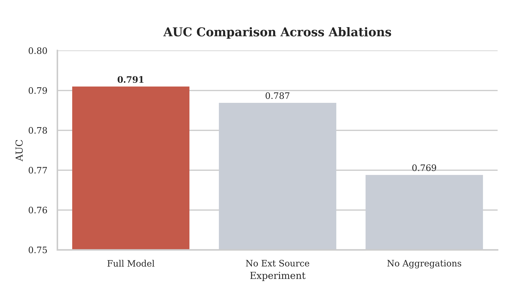
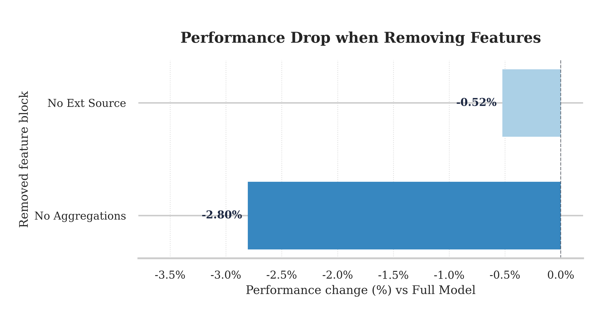
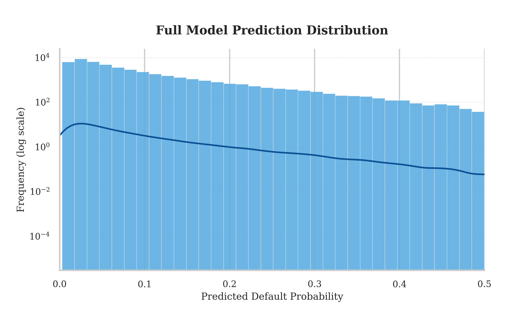

# Experiment Codebase Guide

This folder contains the code for comparative experiments, ablation studies, and model ensembling for the Home Credit Default Risk project.

## 🚀 Quick Start

Follow these steps to reproduce the experimental results:

### 1. Data Preprocessing
First, generate the processed feature files (`train_final.pkl` and `test_final.pkl`). This script performs data cleaning, one-hot encoding, memory reduction, and feature aggregation from auxiliary tables.

```bash
python preprocess_homecredit_FE.py
```
*Input:* Raw CSV files in the parent directory (or configured path).
*Output:* `train_final.pkl`, `test_final.pkl`.

### 2. Single Model Training
Train individual models to compare performance. Each script loads the pickle files generated in step 1, trains the specific model using K-Fold cross-validation, prints the AUC score, and saves a submission file.

**LightGBM Variants:**
```bash
python model_lgbm.py          # Standard LightGBM
python model_lgbm_pro.py      # Tuned LightGBM
python model_lgbm_ultra.py    # Highly optimized LightGBM
python model_lgbm_seed_avg.py # Seed averaging LightGBM
```

**Other Models:**
```bash
python model_xgboost.py       # XGBoost
python model_rf.py            # Random Forest
python model_dt.py            # Decision Tree
python model_logreg.py        # Logistic Regression (requires simple imputation internally)
python model_adaboost.py      # AdaBoost
python model_extratrees.py    # ExtraTrees
```

### 3. Ablation Studies
We conducted ablation studies to understand feature importance by removing specific components and observing performance drops.

Run the ablation experiments:
```bash
# Train model without aggregated features (bureau, prev_app, etc.)
python ablation_no_aggregations.py

# Train model without EXT_SOURCE external scoring features
python ablation_no_ext_source.py
```

**Results Visualization:**
The results are automatically logged to `ablation_results.csv`. To generate the comparison plots:
```bash
python visualization.py
```

**Key Findings:**
- **AUC Comparison:**
  

- **Performance Drop Analysis:**
  Removing aggregated features causes a significant drop, highlighting the value of historical data. EXT_SOURCE features are also critical.
  

- **Risk Distribution:**
  

### 4. Model Ensembling
After training single models, you can combine their predictions to improve performance.

```bash
python ensemble_final.py      # Simple averaging/voting ensemble
python stacking_final.py      # Stacking ensemble (using predictions as features)
python final_blend.py         # Final weighted blending of best models
```

---

## 📂 File Descriptions

### Data Processing
- **`preprocess_homecredit_FE.py`**: **[Main]** The core feature engineering script. Handles missing values, aggregations (Bureau, Prev App, Installments), and memory optimization.
- **`process_data.py` / `process_data_v2.py`**: Alternative/Legacy data processing scripts used for different experimental setups.

### Model Scripts
- **`model_lgbm*.py`**: Various configurations of LightGBM.
- **`model_xgboost.py`**: XGBoost implementation.
- **`model_rf.py`**: Random Forest classifier.
- **`model_dt.py`**: Decision Tree classifier (baseline for tree models).
- **`model_logreg.py`**: Logistic Regression (linear baseline).
- **`model_adaboost.py`**: AdaBoost classifier.
- **`model_extratrees.py`**: ExtraTrees classifier.
- **`model_knn_features.py`**: KNN-based feature extraction/model.

### Ablation Studies
- **`ablation_no_aggregations.py`**: Experiment removing all aggregated features from auxiliary tables.
- **`ablation_no_ext_source.py`**: Experiment removing external source features.
- **`visualization.py`**: Script to visualize ablation results (requires `ablation_results.csv`).

### Ensemble & Utility
- **`ensemble_final.py`**: Implementation of voting/averaging ensembles.
- **`stacking_final.py`**: Stacking implementation where first-level model predictions are used to train a meta-learner.
- **`final_blend.py`**: Script to create the final submission by blending top-performing model outputs.
- **`run_lgbm_v2.py` / `run_mlp_v2.py`**: Runner scripts for batch experiments or specific model versions (MLP = Multilayer Perceptron).

---

## ⚠️ Requirements
Ensure you have the required Python packages installed:
- `pandas`
- `numpy`
- `lightgbm`
- `xgboost`
- `scikit-learn`
- `matplotlib`
- `seaborn`

All scripts assume the data files are located in the path defined within the scripts (usually relative to the project root or in a `home-credit-default-risk` folder).
